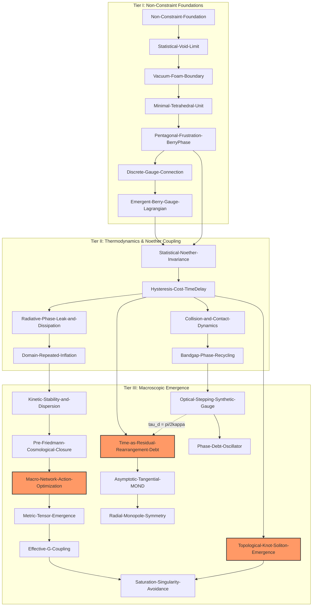

# Canonical Sequence Architecture

> **Notice**: The legacy linear sequence $G \to C_{id} \to S \to R \to M \to L \to F$ has been superseded by the **stationary extended action principle**:
> $$\delta \mathcal{S}_{\text{ext}} = 0$$
> Physics emerges simultaneously across three variational closure tiers.

---

## Tier I — Foundations (Non-Constraint Dynamics)
- [[Non-Constraint-Foundation]]
- [[Statistical-Void-Limit]]
- [[Vacuum-Foam-Boundary]]
- [[Minimal-Tetrahedral-Unit]]
- [[Pentagonal-Frustration-BerryPhase]]
- [[Discrete-Gauge-Connection]]
- [[Emergent-Berry-Gauge-Lagrangian]]
- [[Phase-Retuning-Piecewise-Laws]]

## Tier II — Thermodynamics & Noether Coupling
- [[Statistical-Noether-Invariance]]
- [[Hysteresis-Cost-TimeDelay]]
- [[Collision-and-Contact-Dynamics]]
- [[Bandgap-Phase-Recycling]]
- [[Radiative-Phase-Leak-and-Dissipation]]
- [[Domain-Repeated-Inflation]]
- [[Vacuum-Noise-Register-and-Ratchet]]

## Tier III — Macroscopic Emergence
- [[Kinetic-Stability-and-Dispersion]]
- [[Pre-Friedmann-Cosmological-Closure]]
- [[Macro-Network-Action-Optimization]]
- [[Asymptotic-Tangential-MOND]]
- [[Effective-G-Coupling]]
- [[Metric-Tensor-Emergence]]
- [[Radial-Monopole-Symmetry]]
- [[Saturation-Singularity-Avoidance]]
- [[Time-as-Residual-Rearrangement-Debt]]
- [[Topological-Knot-Soliton-Emergence]]
- [[Optical-Stepping-Synthetic-Gauge]]
- [[Phase-Debt-Oscillator]]

---

## Variational Dependency Graph
