# MOC: Emergence-Core

This document presents the master map of conceptual and mathematical linkages of the Space-Defect Field (SDF) closure theory, framed within the **three-tier variational closure ($\delta \mathcal{S}_{\text{ext}} = 0$)** and the **Historical Residual Closure** paradigm.

---

##  System Emergence and Closure Trajectory

```mermaid
flowchart TD
subgraph Tier1 [Tier I: Foundations & Discrete Geometry]
NCF[Non-Constraint-Foundation] --> SVL[Statistical-Void-Limit]
SVL --> VFB[Vacuum-Foam-Boundary]
VFB --> MTU[Minimal-Tetrahedral-Unit]
MTU --> PFB[Pentagonal-Frustration-BerryPhase]
PFB --> DGC[Discrete-Gauge-Connection]
DGC --> EBL[Emergent-Berry-Gauge-Lagrangian]
PRL[Phase-Retuning-Piecewise-Laws]
end

subgraph Tier2 [Tier II: Thermodynamics, Dissipation & Coupling]
SNI[Statistical-Noether-Invariance]
EAO[Ensemble-Averaging-Observation]
HCT[Hysteresis-Cost-TimeDelay]
CCD[Collision-and-Contact-Dynamics]
PFN[Pentagonal-Frustration-Numerical-Coupling]
BPR[Bandgap-Phase-Recycling]
RPL[Radiative-Phase-Leak-and-Dissipation]
DRI[Domain-Repeated-Inflation]
VNR[Vacuum-Noise-Register-and-Ratchet]
end

subgraph Tier3 [Tier III: Emergent Physics & Macroscopic Closure]
KSD[Kinetic-Stability-and-Dispersion]
PFC[Pre-Friedmann-Cosmological-Closure]
MNA[Macro-Network-Action-Optimization]
MTE[Metric-Tensor-Emergence]
EGC[Effective-G-Coupling]
ATM[Asymptotic-Tangential-MOND]
TRD[Time-as-Residual-Rearrangement-Debt]
TKS[Topological-Knot-Soliton-Emergence]
SSA[Saturation-Singularity-Avoidance]
RMS[Radial-Monopole-Symmetry]
NQH[Noise-Quenching-Homeostasis]
OSS[Optical-Stepping-Synthetic-Gauge]
PDO[Phase-Debt-Oscillator]
end

Tier1 --> Tier2
Tier2 --> Tier3

TRD -.->|Residual-history stabilization| MTE
RPL -.->|Dissipative irreversibility| TRD
OSS -.->|Microscopic origin of tau_d| TRD
OSS -.->|Synthetic gauge flux| BPR
VNR -.->|Trigger, never motor| PDO
PDO -.->|Cycle calendar| TRD
```
