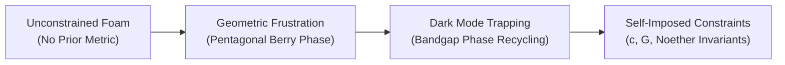

# Non-Constraint Foundation (Bonyad-e-La-Gheyd)

## 1. Ontological Premise
Classical physics and standard quantum field theories impose axiomatic constraints *a priori* (e.g., fixed Minkowski metric $\eta_{\mu\nu}$, strict Lorentz invariance, gauge symmetries $\mathcal{G}$). The Non-Constraint Foundation postulates an unconstrained primordial boundary where no continuous geometric background or conservation law is pre-assumed.

## 2. Dynamic Genesis of Constraints
Constraints are not fundamental laws; they are dynamically emergent attractor states:
1. In an unconstrained stochastic foam, arbitrary phase variations compete.
2. Only configurations forming self-closing geometric feedback loops survive runaway dissipation.
3. The tetrahedral assembly ([[Minimal-Tetrahedral-Unit]]) represents the minimal non-collapsing topological kernel that imposes geometric self-confinement.
