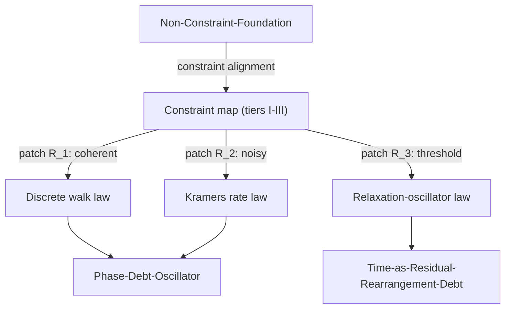

# Phase-Retuning-Piecewise-Laws

## 1. Physical Premise and Context

A "law" is not a fixed object attached to a substance; it is a **function of position on the constraint map**. The same iron sheet obeys a monotone yield law under a single bend and a counted-cycle exhaustion law (fatigue) under counted bends; the same water obeys three different effective formalisms on three patches of its $(T,P)$ diagram, and the boundary law itself degenerates at the critical point. SDF asserts the same for its emergent laws: as constraints align differently, the *form* of the effective law retunes while the substrate constants do not.

- Upstream dependencies: [[Non-Constraint-Foundation]], [[Statistical-Void-Limit]], [[MOC-Emergence-Core]]

## 2. Mathematical Formulation

The effective law is piecewise on the constraint map, partitioned by indicator functions:

$$
\mathcal{L}_{\text{eff}}(x) = \sum_\alpha \chi_\alpha(x)\,\mathcal{L}_\alpha, \qquad
\chi_\alpha(x) = \begin{cases} 1 & x \in R_\alpha(\text{constraints}) \\ 0 & \text{otherwise} \end{cases}
$$

Where:
- $R_\alpha$ — the $\alpha$-th regime patch of the constraint diagram;
- $\mathcal{L}_\alpha$ — the formal law native to that patch;
- the patch boundaries $R_\alpha \cap R_\beta$ — loci where the old formalism dies and a new one is born (universality-class change).

### 2.1 Two exact anchors

| System | Patch | Native law | Change of form |
|---|---|---|---|
| Steel sheet ($t=0.5$ mm, $\varepsilon_y = 0.0011$) | single bend | monotone yield: $R < R_{\min} = 227$ mm | threshold law |
| same sheet | counted bends | Coffin–Manson: $N_f \sim 72$ at $R=5$ mm, $1152$ at $R=20$ mm | integrator + threshold (debt) law |
| water | triple point | Clausius–Clapeyron: $dP/dT \approx 0.2$ kPa/K | coexistence law |
| water | critical point | no boundary, no latent heat; Ising universality $\xi \sim |t|^{-0.63}$ | law degenerates |

### 2.2 The three SDF dynamical regimes as one retuning

The stepping dynamics of [[Optical-Stepping-Synthetic-Gauge]] is one underlying Hamiltonian seen through three patches indexed by $\gamma_\phi/\kappa$ and $k_BT/\hbar\kappa$:

1. **Coherent** ($\gamma_\phi \ll \kappa$): Schrödinger-like discrete walk;
2. **Noise-assisted** ($\gamma_\phi \gtrsim \hbar\kappa \approx k_BT$): Kramers-type rate law;
3. **Threshold** (accumulated $\Phi = \pi$): relaxation-oscillator release ([[Phase-Debt-Oscillator]]).

The form changes; $\delta\theta$, $\kappa(a)$ and $\tau_d$ do not. This is the precise content of "constraint-aligned emergent law": the three-tier architecture of the vault is the constraint map, and each tier hosts the laws native to its patch.

**Consistency checklist:** $\hbar\kappa = 23.8$ meV from [[Optical-Stepping-Synthetic-Gauge]]; regime boundary $k_BT \approx \hbar\kappa$ from [[Vacuum-Noise-Register-and-Ratchet]]; tier correspondence with [[MOC-Emergence-Core]].

## 3. Structural Mechanics and Flow

## 4. Structural Linkages

- [[Statistical-Void-Limit]] — the constraint patch where void geometry fixes the constants.
- [[Kinetic-Stability-and-Dispersion]] — the coherent-patch native law.
- [[Vacuum-Noise-Register-and-Ratchet]] — the noise-assisted patch.
- [[Phase-Debt-Oscillator]] — the threshold patch.
- [[Hysteresis-Cost-TimeDelay]] — the cost that distinguishes patches thermodynamically.

## 5. References & Supporting Nodes

- [[Paper-Optical-Metric-Topological-Photonics]] — universality and crossover anchors for retuned laws.
- [[Paper-Material-Time-Glasses]] — physical aging as a retuned-law domain (material-time patch).
