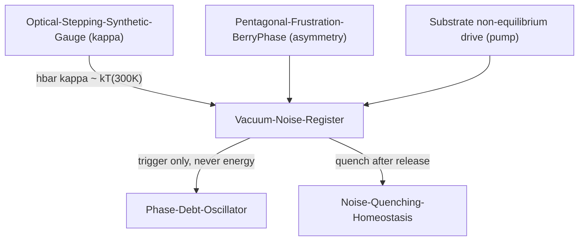

# Vacuum-Noise-Register-and-Ratchet

## 1. Physical Premise and Context

The stepping dynamics of [[Optical-Stepping-Synthetic-Gauge]] is quantized by the vacuum. This note fixes **in which register the vacuum noise operates** — a distinction that decides whether the mechanism is lawful or violates the second law. It refines [[Noise-Quenching-Homeostasis]] and gives the entropy bookkeeping of [[Hysteresis-Cost-TimeDelay]].

- Upstream dependencies: [[Optical-Stepping-Synthetic-Gauge]], [[Bandgap-Phase-Recycling]], [[Hysteresis-Cost-TimeDelay]]

## 2. Mathematical Formulation

### 2.1 The three registers of vacuum noise

| Register | Statement | Verdict |
|---|---|---|
| **Seed** | vacuum fluctuations initiate transfer into the empty neighbour mode | ✓ spontaneous emission into the coupled mode |
| **Matrix element** | the hop amplitude $\kappa$ *is* the vacuum-mediated overlap through the neck | ✓ $\dot a = (i\omega_0-\gamma)a - i\kappa a_{\text{nb}} + \sqrt{2\gamma}\,\xi_{\text{vac}}(t)$ |
| **Motor** | vacuum noise drives *directed* transport | ✗ forbidden — the zero-point bath is passive (Pusz–Woronowicz); equilibrium noise performs no directed work |

Noise and loss are one reservoir (fluctuation–dissipation theorem): $\xi_{\text{vac}}$ and $\gamma$ share the same spectral density.

### 2.2 Quantitative regime boundaries

With $\lambda_0 = 0.64\,a$ and $\kappa/\omega_0 = 6.1\times10^{-3}$:

$$
\hbar\kappa = 23.8\ \text{meV} \;\approx\; k_B T_{300\text{K}} = 25.9\ \text{meV}, \qquad
n_{\text{th}} = 8\times10^{-66} \;(\lambda_0 = 320\,\text{nm})
$$

- The **hopping quantum equals room-temperature thermal energy** — the coherent/incoherent crossover sits exactly at ambient conditions.
- Pure-vacuum regime holds for $\lambda_0 \lesssim 48\,\mu\text{m}$; beyond that the statistical noise becomes thermal, not vacuum.
- Vacuum noise temperature $T_n = \hbar\omega_0/2k_B \approx 2.2\times10^4$ K — hot but **passive**.

### 2.3 The ratchet triad (lawful directed transport)

Directed transport from noise requires asymmetry **and** non-equilibrium on a noise bath:

$$
\text{asymmetry } (\delta\theta) \;+\; \text{pump } (\Delta P) \;+\; \text{bath } (\xi_{\text{vac}}) \;=\; \text{lawful ratchet}
$$

- asymmetry — the pentagonal deficit, geometry-fixed ([[Pentagonal-Frustration-BerryPhase]]);
- pump — the non-equilibrium drive of the substrate (differential-pressure channel of the framework);
- bath — vacuum/thermal noise, trigger only.

Removal of the pump must switch off directed current while leaving undirected hops — a decisive falsification test separating "seed" from "motor".

**Consistency checklist:** $\hbar\kappa$ from [[Optical-Stepping-Synthetic-Gauge]]; $\delta\theta = 0.128388$ rad from [[Pentagonal-Frustration-Numerical-Coupling]]; entropy bookkeeping consistent with [[Statistical-Noether-Invariance]].

## 3. Structural Mechanics and Flow

## 4. Structural Linkages

- [[Noise-Quenching-Homeostasis]] — post-release quench is the homeostatic return of this register.
- [[Vacuum-Foam-Boundary]] — the boundary zero-points where emission/reception is phase-matched.
- [[Radiative-Phase-Leak-and-Dissipation]] — the loss channel $\gamma$ conjugate to $\xi_{\text{vac}}$.
- [[Phase-Debt-Oscillator]] — Kramers-triggered threshold release of accumulated debt.

## 5. References & Supporting Nodes

- [[Paper-Optical-Metric-Topological-Photonics]] — fluctuation–dissipation and Kramers escape grounds.
- [[Paper-England-Dissipative-Adaptation]] — driven matter organizing around absorption history (pump register).
