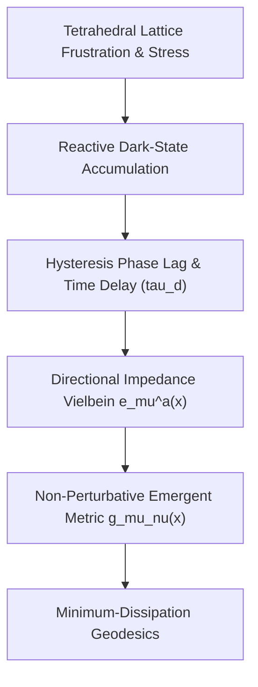

# Emergence of the Classical Metric Tensor via Tetrad Impedance

Classical spacetime geometry $g_{\mu\nu}(x)$ is not a fundamental entity, nor is it a perturbation over a pre-existing Minkowski background ($\eta_{\mu\nu}$). Within the Spatial Deformation Field (SDF) framework, the macroscopic metric tensor emerges fundamentally from the microscopic impedance tensor of the frustrated cellular tetrahedral network.

---

## 1. The Vielbein / Tetrad Formulation of Network Impedance

Rather than postulating an a priori metric, geometry emerges through directional transmission coefficients (local tetrad fields $e_\mu^a(x)$). 

Let the microscopic frustrated network define a local frame basis $a, b \in \{0, 1, 2, 3\}$ representing internal stress-phase directions. The coupling between the coordinate displacement $dx^\mu$ and internal relaxation modes is governed by the vielbein:
$$e_\mu^a(x) = \bar{e} \, \delta_\mu^a + \kappa \, Z_\mu^a(x)$$

Where:
- $\bar{e}$ is the bare topological scale of the undistorted tetrahedral edge.
- $Z_\mu^a(x)$ is the **local network impedance tensor**, determined by the reactive phase-leak and dark-state storage within the tetrahedral voids.
- $\kappa$ is the network elastance constant.

The emergent spacetime metric is defined non-perturbatively by contracting the tetrads with the internal Minkowski frame metric $\eta_{ab} = \text{diag}(-1, +1, +1, +1)$:
$$g_{\mu\nu}(x) = e_\mu^a(x) \, e_\nu^b(x) \, \eta_{ab}$$

Expanding this product yields the complete, background-independent geometry:
$$g_{\mu\nu}(x) = \bar{e}^2 \eta_{\mu\nu} + \kappa \bar{e} \left( Z_{\mu a} \delta_\nu^a + Z_{\nu a} \delta_\mu^a \right) + \kappa^2 Z_\mu^a Z_{\nu}^b \eta_{ab}$$

---

## 2. Microscopic Origin of the Impedance Tensor $Z_{\mu}^a$

The impedance tensor is directly sourced by the local reactive stress tensor $\mathcal{S}_{\mu\nu}^{\text{reactive}}$ and the hysteresis time-delay $\tau_d$:
$$Z_\mu^a(x) = \frac{\tau_d(x)}{\rho_{\text{lattice}}} \sum_{k \in \text{edges}} \left( \hat{n}_\mu^{(k)} \hat{v}_{(k)}^a \right) \Delta \theta_k^{\text{frust}}$$

Where:
- $\hat{n}_\mu^{(k)}$ is the directional embedding of the $k$-th tetrahedral edge.
- $\hat{v}_{(k)}^a$ is the internal phase projection vector.
- $\Delta \theta_k^{\text{frust}}$ represents the frustration-induced phase lag.
- $\tau_d$ is the local hysteresis delay ([[Hysteresis-Cost-TimeDelay]]).

When the network is devoid of reactive strain ($\tau_d \to 0$), $Z_\mu^a \to 0$, recovering the baseline conformal scale. Under concentrated reactive dark states, the quadratic term $\kappa^2 Z_\mu^a Z_\nu^b \eta_{ab}$ dominates, naturally producing strong-field curvature without singularities.

---

## 3. Geodesic Principle as Least-Dissipation Path

Excitations do not experience a geometric force. Propagation trajectories follow the path of **least action / minimum phase dissipation**:
$$\delta \int \mathcal{L}_{\text{transport}} \, d\lambda = 0$$

Where the transport Lagrangian is:
$$\mathcal{L}_{\text{transport}} = \sqrt{- g_{\mu\nu}(x) \dot{x}^\mu \dot{x}^\nu} = \sqrt{- \eta_{ab} \left( e_\mu^a \dot{x}^\mu \right) \left( e_\nu^b \dot{x}^\nu \right)}$$

The geodesic equation emerges directly as the Euler-Lagrange condition for signal propagation across heterogeneous impedance domains.

---

## 4. Dynamical Flow Pipeline
