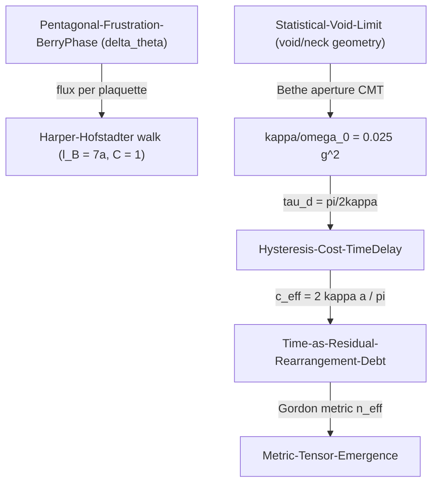

# Optical-Stepping-Synthetic-Gauge

## 1. Physical Premise and Context

This note supplies the **microscopic propagation channel** of SDF: phase excitation does not flow continuously through the frustrated lattice but **steps hop-by-hop between adjacent void cavities** through the triangular necks of the tangent-sphere packing, acquiring exactly one deficit of phase per pentagonal loop. It thereby upgrades two asserted vault constants — $\tau_d$ ([[Hysteresis-Cost-TimeDelay]]) and $c_{\text{eff}}$ ([[Time-as-Residual-Rearrangement-Debt]]) — from postulates to derived quantities, and equips the network with a synthetic gauge field ([[Bandgap-Phase-Recycling]]).

- Upstream dependencies: [[Pentagonal-Frustration-BerryPhase]], [[Minimal-Tetrahedral-Unit]], [[Statistical-Void-Limit]]

## 2. Mathematical Formulation

### 2.1 Exact packing geometry (parameter-free)

For mutually tangent spheres of radius $r_0 = a/2$ at tetrahedron vertices (edge $a$):

| Quantity | Closed form | Value |
|---|---|---|
| Void inscribed sphere | $r_{\text{in}} = r_0(\sqrt{3/2}-1)$ | $0.1124\,a$ |
| Triangular neck inradius | $\rho = r_0(2/\sqrt{3}-1)$ | $0.0774\,a$ |
| Equivalent round aperture | $r_{\text{eq}} = \sqrt{3\sqrt{3}\,\rho^2/\pi}$ | $0.0995\,a$ |
| Adjacent-void center spacing | $d_{\text{cc}} = r_0\sqrt{2/3}$ | $0.408\,a$ |
| Void volume | $\tfrac{4}{3}\pi r_0^3 - \tfrac{8\sqrt2}{3}r_0^3$ | $0.4176\,r_0^3$ ✓ [[Statistical-Void-Limit]] |

### 2.2 Coupling rate from Bethe-aperture theory

Coupled-mode theory with magnetic polarizability $M = \tfrac{4}{3}r_{\text{eq}}^3$ gives

$$
\frac{\kappa}{\omega_0} = C_B\,\frac{r_{\text{eq}}^3}{V_{\text{void}}}\,g^2 \approx 0.025\,g^2
$$

Where:
- $\kappa$ — reactive (near-field) hopping rate between adjacent void cavities.
- $\omega_0$ — fundamental cavity resonance of the void mode.
- $g = |H(\text{neck})|/|H(\text{max})|$ — the only non-geometric factor, $\mathcal{O}(0.3\text{–}1)$.
- Central case $g \approx 0.57$: $\kappa/\omega_0 \approx 6.1\times10^{-3}$, $Q_{\text{hop}} = \omega_0/\kappa \approx 163$.

### 2.2.1 Numerical status of $g$ (2026-09-20)

A first-principles FDTD benchmark (`tools/cavity_pair_fdtd2d.py`, 2D PEC proxy of the void pair, supermode-splitting method) confirms the **structure** of the law and brackets $g$:

- splitting-based $\kappa/\omega_0$ follows a power law in neck width with exponent $p \approx 3.3$ — the Bethe $w^3$ structure holds numerically;
- the measured mode field at the wall gives $g \approx 0.9$ for the fundamental mode (analytic wall-center value $1/\sqrt2 \approx 0.71$ for the square TM mode; the CMT assumption 0.57 was conservative);
- with $g \approx 0.7\text{–}0.9$: $\kappa/\omega_0 \approx (1.2\text{–}2.0)\times10^{-2}$, $Q_{\text{hop}} \approx 50\text{–}80$, $\tau_d \approx 26\text{–}42\,T_0$.

The 2D prefactor is not the 3D Bethe constant by construction; the decisive run is the real-geometry Meep script `tools/meep_void_pair_3d.py` (dielectric-sphere voids, $r_{eq}$ window, supermode splitting). Until that run, the vault carries $g \in [0.7, 0.9]$ with the corresponding $\kappa/\omega_0 \sim 10^{-2}$ band — the mechanism's qualitative conclusions (stepping, $\tau_d \sim 10\text{–}100\,T_0$, $c_{\text{eff}} \sim 0.1c$) are insensitive to this factor-of-2.

**Derived clock and speed** (scale-free; $\kappa \propto 1/a$ in absolute units):

$$
\tau_d = \frac{\pi}{2\kappa} \approx 26\text{–}41\,T_0, \qquad
c_{\text{eff}} = \frac{\ell^*}{\tau_d} = \frac{2\kappa a}{\pi} = \frac{2}{\pi}\,v_{g,\max} \approx 0.12\,c
$$

so the vault kinematic relation $c_{\text{eff}} = \ell^*/\tau_d$ is **automatically satisfied** as the band-averaged tight-binding velocity.

### 2.3 Synthetic gauge field and optical geodesics

Flux $\delta\theta = 2\pi - 5\arccos(1/3)$ per plaquette ([[Pentagonal-Frustration-Numerical-Coupling]]) realizes a Harper–Hofstadter problem:

$$
\ell_B = a\sqrt{\frac{2\pi}{\delta\theta}} = 6.996\,a \approx 7a, \qquad C_{\text{lowest band}} = 1
$$

- exactly **one chiral one-way mode** per edge — the guided "filament" is topologically protected against backscattering;
- light crossing/encircling a five-fold axis kinks by exactly $\delta\theta$ (disclination optics, cosmic-string geometry) — a **parameter-free deflection**;
- the ray limit is the Gordon optical metric with $n_{\text{eff}}(x) = c/c_{\text{eff}}(x) = c\,\tau_d/\ell^*$:

$$
ds^2_{\text{opt}} = \frac{c^2}{n_{\text{eff}}^2(x)}\,dt^2 - d\vec{x}^{\,2}
$$

so the $\tau_d$-field *is* the refractive-index field of an emergent optical geometry ([[Metric-Tensor-Emergence]], [[Pre-Friedmann-Cosmological-Closure]]).

**Consistency checklist:** $\delta\theta = 0.128388\,222$ rad verified against [[Pentagonal-Frustration-Numerical-Coupling]]; $\tau_d = \pi/2\kappa$ dimensionally consistent with [[Hysteresis-Cost-TimeDelay]]; $c_{\text{eff}} = 2\kappa\ell^*/\pi$ consistent with [[Time-as-Residual-Rearrangement-Debt]].

## 3. Structural Mechanics and Flow

## 4. Structural Linkages

- [[Bandgap-Phase-Recycling]] — dark modes localize the hop; the chiral edge mode is its one-way continuation.
- [[Radiative-Phase-Leak-and-Dissipation]] — the azimuthal near-field channel $S_\phi \sim 1/r^3$ is the carrier that accumulates the loop holonomy.
- [[Noise-Quenching-Homeostasis]] — regime boundary of coherent stepping, see [[Vacuum-Noise-Register-and-Ratchet]].
- [[Phase-Debt-Oscillator]] — the slow envelope of the stepping dynamics.
- [[Paper-Optical-Metric-Topological-Photonics]] — Gordon metric, Hofstadter spectrum, CROW proposal, Bethe aperture theory.

## 5. References & Supporting Nodes

- [[Paper-Optical-Metric-Topological-Photonics]] — grounds the optical metric, synthetic flux, aperture coupling.
- [[Paper-Chu-Harrington-Antenna-Q-Bounds]] — reactive/radiative split underlying the near-field hop.
- [[Paper-Bound-States-in-Continuum-Dark-Modes]] — non-radiating localization of the void modes.
