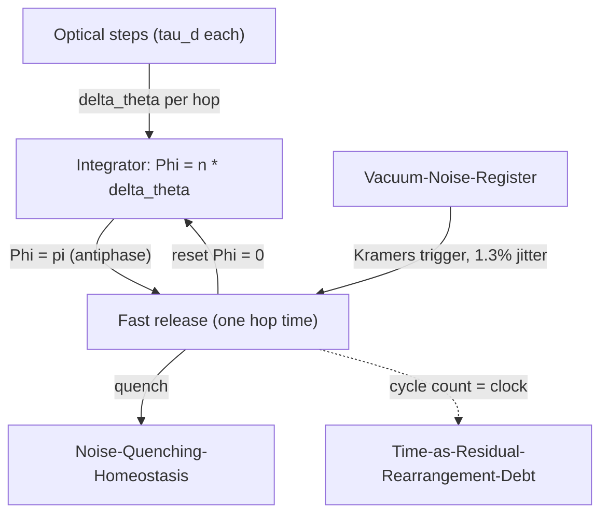

# Phase-Debt-Oscillator

## 1. Physical Premise and Context

Each optical step deposits exactly one deficit of phase debt, $\delta\theta$ ([[Optical-Stepping-Synthetic-Gauge]]). Accumulated debt is the *integrator* of a relaxation oscillator; noise is only its *trigger* ([[Vacuum-Noise-Register-and-Ratchet]]); the turning point at accumulated antiphase is the *release*. This is the dynamical, closed-mathematics form of the residual-rearrangement picture ([[Time-as-Residual-Rearrangement-Debt]]) and the temporal envelope of [[Hysteresis-Cost-TimeDelay]].

- Upstream dependencies: [[Optical-Stepping-Synthetic-Gauge]], [[Vacuum-Noise-Register-and-Ratchet]], [[Pentagonal-Frustration-BerryPhase]]

## 2. Mathematical Formulation

### 2.1 Accumulation → turning point → release

$$
\dot\Phi = \frac{\delta\theta}{\tau_d} = 2.95\times10^{12}\ \text{rad\,s}^{-1}, \qquad
\Phi = \pi \;\Rightarrow\; N_c = \frac{\pi}{\delta\theta} = 24.47\ \text{hops}
$$

Where:
- $\Phi$ — accumulated phase mismatch (the order variable of the cycle);
- $\delta\theta = 0.128388\,222$ rad — debt per loop ([[Pentagonal-Frustration-Numerical-Coupling]]);
- $N_c$ — hops to the antiphase turning point.

### 2.2 Cycle predictions (parameter-free given $\kappa$)

| Quantity | Value ($a = 500$ nm, $g=0.57$) | Scaling |
|---|---|---|
| Cycle period $T_{\text{cyc}} = N_c \tau_d$ | $1.066$ ps | $\propto 1/\kappa \sim a$ |
| Cycle frequency | $0.94$ THz | $\propto 1/a$ |
| Scale separation $T_{\text{cyc}}/\tau_{\text{release}}$ | $24.5:1$ | slow load, fast release |
| Energy released per cycle | $N_c\,\hbar\kappa \approx 0.58$ eV | from stored debt, not from noise |
| Kramers trigger jitter | $1/W \approx 14$ fs $= 1.3\%$ | noise sets *when*, never *how much* |

### 2.3 Period-2 subharmonic and the 49-step revival

Because $N_c = \pi/\delta\theta$ exactly, the residual phase after each cycle alternates $\pi, 0, \pi, 0\ldots$ — a **period-2 subharmonic**. The previously noted near-revival of the walk at $\approx 49$ steps is precisely **two debt cycles** ($2N_c = 48.94$): geometry, coupling and calendar independently close on the same number.

**Consistency checklist:** $\delta\theta$ against [[Pentagonal-Frustration-Numerical-Coupling]]; $\tau_d$ against [[Optical-Stepping-Synthetic-Gauge]] and [[Hysteresis-Cost-TimeDelay]]; soft-mode release candidate consistent with the stability bound of [[Kinetic-Stability-and-Dispersion]].

## 3. Structural Mechanics and Flow

## 4. Structural Linkages

- [[Time-as-Residual-Rearrangement-Debt]] — the cycle counter *is* the material clock: one debt cycle per $N_c$ rearrangements.
- [[Noise-Quenching-Homeostasis]] — amplitude-dependent damping returns the system to the accumulation branch after each release.
- [[Bandgap-Phase-Recycling]] — release energy is recycled into dark modes when it lands inside the gap.
- [[Kinetic-Stability-and-Dispersion]] — antiphase softening of the coupling is the natural release channel; must be derived, not assumed.
- [[Phase-Retuning-Piecewise-Laws]] — the three cycle regimes are one "phase" of the retuning map.

## 5. References & Supporting Nodes

- [[Paper-Optical-Metric-Topological-Photonics]] — Kramers escape and relaxation-oscillator anchors.
- [[Paper-Material-Time-Glasses]] — material time as accumulated rearrangement count (macroscopic analogue).
