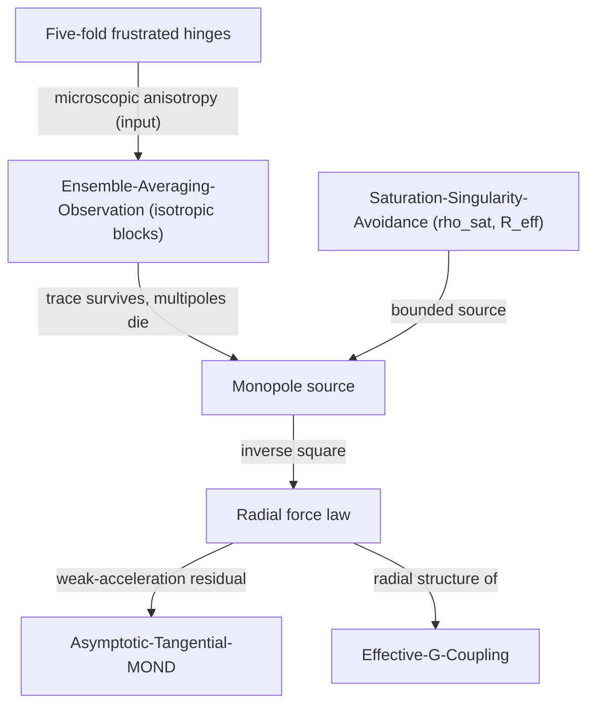

# Radial-Monopole-Symmetry

## 1. Physical Premise and Context

The microscopic SDF substrate is maximally anisotropic: discrete hinges, five-fold frustrated loops ([[Pentagonal-Frustration-BerryPhase]]), directed chiral channels ([[Optical-Stepping-Synthetic-Gauge]]). Yet the long-range emergent force is strictly monopolar — inverse-square. This note supplies the missing step: **isotropic coarse-graining is a symmetry-reduction filter** that keeps only the trace (monopole) of any microscopic distribution and kills every traceless multipole with a computable power of the block size. The monopole is not assumed; it is the *unique survivor* of ensemble averaging ([[Ensemble-Averaging-Observation]]).

- Upstream dependencies: [[Ensemble-Averaging-Observation]], [[Statistical-Void-Limit]], [[Effective-G-Coupling]]

## 2. Mathematical Formulation

### 2.1 Isotropic averaging: only the trace survives

For a random isotropic direction $\hat n$:

$$
\langle \hat n_i \hat n_j \rangle = \frac{\delta_{ij}}{3}, \qquad
\langle \hat n_i \hat n_j \hat n_k \hat n_l \rangle \propto \delta_{(ij}\delta_{kl)}, \qquad
\langle \cos^2\theta\rangle = \tfrac13
$$

Any microscopic multipole tensor contracts against these isotropic averages: **the trace contracts to a scalar (the monopole); every traceless multipole contracts to zero.** The inverse-square field that survives coarse-graining is therefore structurally forced:

$$
\langle F\rangle(r) = \frac{G_{\text{eff}}\, m_1 m_2}{r^2}\,\hat r, \qquad
\nabla\cdot\mathbf g = -4\pi G_{\text{eff}}\,\rho
$$

### 2.2 Multipolar decay: the computable remnant

Anisotropy does not vanish magically — it decays with block size $N_{\text{blk}}$ as a central-limit residual:

| Block $N_{\text{blk}}$ | Anisotropic residual (of monopole) |
|---|---|
| $10^2$ | $10^{-1}$ |
| $10^4$ | $10^{-2}$ |
| $10^6$ | $10^{-3}$ |
| $10^8$ | $10^{-4}$ |

$$
\left|\frac{\Phi_{\ell\ge1}}{\Phi_0}\right| \sim N_{\text{blk}}^{-1/2}
$$

This residual is not waste: at galactic scales, where Newtonian acceleration falls toward $a_0$, the suppressed angular channel re-enters as the asymptotically dominant correction — the deep-MOND transition of [[Asymptotic-Tangential-MOND]] ($v_{\text{flat}} = (GMa_0)^{1/4}$).

### 2.3 Why the monopole is fed by saturation

The source strength itself is bounded by the packing ceiling of [[Saturation-Singularity-Avoidance]]: node density $\le \rho_{\text{sat}}$ and hinge curvature $\le R_{\text{eff}} = 0.2965\,\ell_0^{-2}$. Bounded, isotropically averaged sources produce exactly the Poisson form above with

$$
G_{\text{eff}} \sim \frac{\ell_{\text{Planck}}^2 c_{\text{eff}}^3}{\hbar}\left(\frac{\tau_d}{\tau_{\text{cycle}}}\right)
$$

(inherited unchanged from [[Effective-G-Coupling]]; only its radial *structure* is derived here).

**Consistency checklist:** $a_0 = c_{\text{eff}}\gamma_B/\tau_d$ against [[Asymptotic-Tangential-MOND]]; $R_{\text{eff}} = 0.2965$ against [[Pentagonal-Frustration-Numerical-Coupling]]; $\rho_{\text{sat}}$ against [[Statistical-Void-Limit]]; $\tau_d$-scaling against [[Hysteresis-Cost-TimeDelay]].

## 3. Structural Mechanics and Flow

## 4. Structural Linkages

- [[Ensemble-Averaging-Observation]] — the averaging operation that performs the symmetry reduction.
- [[Effective-G-Coupling]] — supplies the coupling magnitude; this note derives its radial form ($1/r^2$, Poisson).
- [[Asymptotic-Tangential-MOND]] — the decaying multipolar residual re-emerges as the deep-MOND correction.
- [[Saturation-Singularity-Avoidance]] — bounded sources (density and curvature caps) feeding the monopole.
- [[Statistical-Void-Limit]] — geometric origin of the source discreteness.
- [[Metric-Tensor-Emergence]] — spherically symmetric coarse metrics (Birkhoff-type behavior) downstream.
- [[Pre-Friedmann-Cosmological-Closure]] — isotropic expansion sector built on the same monopole.
- [[Optical-Stepping-Synthetic-Gauge]] — the microscopic anisotropy that averaging must wash out (chiral channels).
