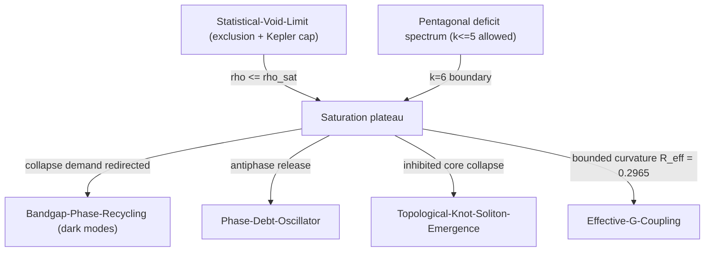

# Saturation-Singularity-Avoidance

## 1. Physical Premise and Context

Classical singularities are curvature divergences: compaction without limit. In SDF the substrate is a discrete packing ([[Statistical-Void-Limit]], [[Minimal-Tetrahedral-Unit]]), and compaction is a **counting process**: curvature lives on packing hinges, and only finitely many regular tetrahedra fit around any hinge. Saturation is therefore a *geometric theorem*, not a dynamical fine-tuning: when no further allowed wedge fits, the lattice enters a plateau and the classical singularity is replaced by bounded curvature. This note supplies the collapse-inhibition channel consumed by [[Topological-Knot-Soliton-Emergence]] and the density ceiling used by [[Effective-G-Coupling]].

- Upstream dependencies: [[Statistical-Void-Limit]], [[Pentagonal-Frustration-Numerical-Coupling]], [[Ensemble-Averaging-Observation]]

## 2. Mathematical Formulation

### 2.1 The deficit spectrum: why $k=5$ is the last allowed packing

For $k$ regular tetrahedra around one common edge, the deficit is $\delta_k = 2\pi - k\arccos(1/3)$:

| $k$ | $\delta_k$ | Verdict |
|---|---|---|
| 3 | $+148.41°$ | allowed (loose) |
| 4 | $+77.88°$ | allowed |
| **5** | $\mathbf{+7.356°}$ | **allowed — densest positive-deficit packing** ([[Pentagonal-Frustration-Numerical-Coupling]]) |
| 6 | $-63.17°$ | **angle excess — geometrically forbidden** |
| 7 | $-133.70°$ | forbidden |

Compaction beyond the five-fold state demands wedges with *negative* deficit — an impossibility for regular cells in flat space. **The saturation cap is the $k=6$ boundary of the deficit spectrum.**

### 2.2 Density ceiling and plateau dynamics

The hard-core exclusion and the Kepler cap fix the ceiling ([[Statistical-Void-Limit]]):

$$
\rho(r) \le \rho_{\text{sat}} = \frac{N_{\max}}{V_{\text{excl}}}, \qquad
V_{\text{excl}} = \frac{\pi a^3}{6},\qquad
\varphi_{\max} = \frac{\pi}{\sqrt{18}} = 0.7405 \;\Rightarrow\; \text{void fraction } 0.2595
$$

Where:
- $V_{\text{excl}}$ — hard-core exclusion volume per node (tangent spheres $a/2$);
- $\varphi_{\max}$ — densest sphere-packing fraction (Hales, 2005) — independent confirmation that compaction stalls.

As demanded density approaches $\rho_{\text{sat}}$, the response is not divergence but a **plateau**: energy that cannot become compaction is expelled along the allowed channel — release into dark modes within the gap ([[Bandgap-Phase-Recycling]]) and the antiphase soft-mode release of [[Phase-Debt-Oscillator]]. Collapse demand is thus *redirected*, not amplified.

### 2.3 Curvature is capped, because its carriers saturate

In Regge language curvature is concentrated on hinges, and the vault constant is exactly the five-fold hinge curvature:

$$
R_{\text{eff}} = \frac{\delta_\theta}{A_\triangle} = \frac{0.128388}{\sqrt{3}/4} = 0.2965\,\ell_0^{-2}
$$

(identified as the "Singularity Avoidance Radius" of [[Pentagonal-Frustration-Numerical-Coupling]]). Since each hinge carries at most $\delta_\theta$ and hinge density is bounded by the packing cap, total curvature density is bounded:

$$
\langle R \rangle \le \frac{\delta_\theta}{A_\triangle} \times n_{\text{hinge}} \;<\; \infty
$$

— the formal statement of singularity avoidance: **the singularity would require a wedge that does not exist in the spectrum.**

**Consistency checklist:** $\delta_\theta$ against [[Pentagonal-Frustration-Numerical-Coupling]]; $V_{\text{void}} = 0.4176\,r_0^3$ against [[Statistical-Void-Limit]]; $R_{\text{eff}} = 0.2965\,\ell_0^{-2}$ recovered from $\delta_\theta/A_\triangle$; release channel consistent with the stability bound of [[Kinetic-Stability-and-Dispersion]].

## 3. Structural Mechanics and Flow

## 4. Structural Linkages

- [[Statistical-Void-Limit]] — the ceiling numbers ($V_{\text{excl}}$, void fraction) and the $V_{\text{void}}$ volume.
- [[Pentagonal-Frustration-Numerical-Coupling]] — deficit spectrum and the hinge-curvature constant $R_{\text{eff}}$.
- [[Topological-Knot-Soliton-Emergence]] — collapse inhibition is precisely what forces Hopfion condensation instead of radial collapse.
- [[Bandgap-Phase-Recycling]] — the dark-mode channel that absorbs redirected compaction energy.
- [[Phase-Debt-Oscillator]] — the temporal (antiphase) release branch of the same redirection.
- [[Effective-G-Coupling]] — bounded curvature feeds the radial structure and the $G_{\text{eff}}$ scaling.
- [[Ensemble-Averaging-Observation]] — coarse-graining under which the plateau is observed as a smooth density cap.
- [[Noise-Quenching-Homeostasis]] — the plateau + quench pair is the homeostatic attractor.
