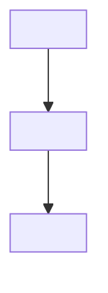

# <Note Title>

> **Instructions for use (delete this block when instantiating):**
> 1. Copy this file into the appropriate tier folder (`01_Foundations` … `04_Emergent_Physics`), or `05_Literature_Grounding` for paper notes.
> 2. Fill in every `<placeholder>` below; remove any optional section you do not use.
> 3. Keep YAML frontmatter fields exactly as named — downstream automation (Zenodo sectioning, QA scripts) depends on them.
> 4. Status vocabulary: `draft` → `active` → `canonical` → `canonical-reviewed`. Use `stub-restored` only for notes rebuilt from fragmentary material.
> 5. Link related notes with `[[Wikilinks]]`; every link must resolve to an existing note or alias.

---

```yaml
---
title: "<Note Title>"
aliases:
  - "<Alias 1>"
created: <YYYY-MM-DD>
tags:
  - sdf/tier1 | sdf/tier2 | sdf/tier3 | literature/grounding | sdf/template
  - "<topic-tag>"
zenodo_section: "Foundations | Lattice-Geometry | Thermodynamics | Emergent-Physics | Literature-Grounding | Templates"
status: "draft | active | canonical | canonical-reviewed | stub-restored"
license: "MIT"
---
```

# <Note Title>

## 1. Physical Premise and Context

State the physical premise in one or two paragraphs. Explicitly identify which upstream concepts this note depends on and which postulate of the framework (e.g., the stationary extended action $\delta \mathcal{S}_{\text{ext}} = 0$) it serves.

- Upstream dependencies: [[<Upstream-Note-1>]], [[<Upstream-Note-2>]]

## 2. Mathematical Formulation

Present the core equations in display math with every symbol defined immediately below:

$$
\mathcal{L}_{\text{eff}} = \langle \text{kinetic term} \rangle - \langle \text{potential term} \rangle
$$

Where:
- `<symbol>` — definition and physical role.
- `<symbol>` — definition and physical role.

**Consistency checklist (do not delete):** verify numerical constants against [[Pentagonal-Frustration-Numerical-Coupling]] and dimensional consistency with [[Hysteresis-Cost-TimeDelay]] ($\tau_d$) and [[Time-as-Residual-Rearrangement-Debt]] ($c_{\text{eff}} = \ell^* / \tau_d$).

## 3. Structural Mechanics and Flow (optional)



## 4. Structural Linkages

- [[<Related-Note>]] — <one-line description of the relationship>
- [[<Related-Note>]] — <one-line description of the relationship>

## 5. References & Supporting Nodes (optional)

- [[Paper-<Reference>]] — <what this literature source grounds in this note>
