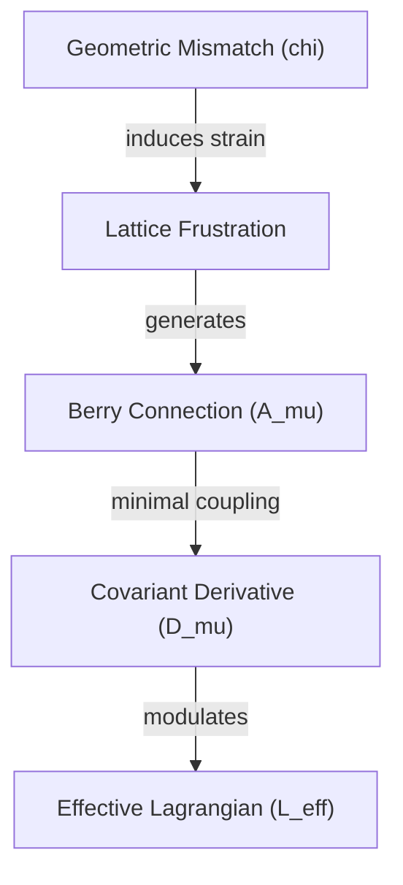

# Emergent-Berry-Gauge-Lagrangian

## 1. Physical Premise and Context
In the sub-manifold discrete geometry, microscopic non-Euclidean packing of the [[Minimal-Tetrahedral-Unit]] generates a localized geometric angular deficit ($\chi_{\text{mismatch}}$). When closed parallel transport cycles are evaluated across these frustrated simplices, anholonomy manifests as an emergent Berry geometric phase. This geometric mismatch directly maps onto an emergent $U(1)$ gauge connection ($\mathcal{A}_{\mu}^{\text{Berry}}$), providing the kinetic mediation via the covariant derivative $D_{\mu} = \partial_{\mu} - i \mathcal{A}_{\mu}^{\text{Berry}}$ that ensures dynamic phase stability and energy homeostasis across the macro-network.

## 2. Mathematical Formulation
The effective field formulation based on the covariant derivative under the emergent Berry phase connection and geometric mismatch coupling is defined as:

$$
\mathcal{L}_{\text{eff}} = \frac{1}{2} (D_{\mu}\phi)^{\dagger} (D^{\mu}\phi) - V_{\text{frustration}}(\phi) - \frac{1}{4} \mathcal{F}_{\mu\nu} \mathcal{F}^{\mu\nu}
$$

$$
V_{\text{frustration}}(\phi) = \lambda \left( |\phi|^2 - \eta^2 \right)^2 + g_{\text{local}} \chi_{\text{mismatch}} |\phi|^2
$$

Where:
- $\phi$ represents the complex reactive scalar phase.
- $D_{\mu} = \partial_{\mu} - i \mathcal{A}_{\mu}^{\text{Berry}}$ is the covariant derivative coupled to the emergent Berry connection $\mathcalchi_{\text\mu}^{\text{Berry}}$ arising from pentagonal frustration.
- $\chi_{\text{mismatch}}$ is the localized geometric mismatch parameter.
- $g_{\text{local}}$ represents the coupling strength between lattice frustration and the phase field.
- $\mathcal{F}_{\mu\nu} = \partial_{\mu}\mathcal{A}_{\nu}^{\text{Berry}} - \partial_{\nu}\mathcal{A}_{\mu}^{\text{Berry}}$ is the emergent field strength tensor.

## 3. Structural Mechanics and Flow
