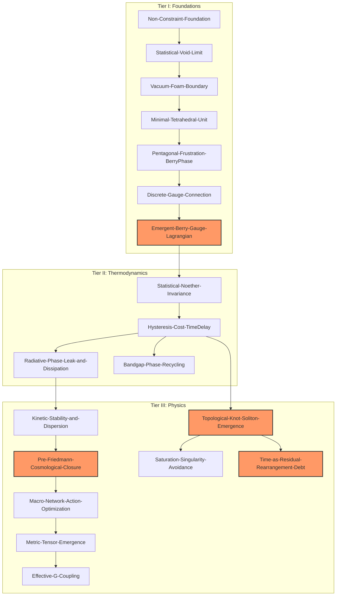

# Emergence-SDF-Vault (v30 / Production-Ready)

> **Core Foundational Postulate**:
> The historical linear causal reduction ($G \to C_{id} \to S \to R \to M \to L \to F$) is rigorously superseded by the **stationary extended action principle**:
> $$\delta \mathcal{S}_{\text{ext}} = 0$$
> Physical reality, gauge invariances, and metric curvature emerge synchronously across three variational closure tiers.

---

## 1. Executive Summary & Epistemology

**Emergence-SDF-Vault** is a formalized, modular knowledge-graph and theoretical framework modeling the emergence of spacetime, effective gravitational coupling, and gauge interactions directly from discrete, non-Euclidean sub-manifold geometries. 

Instead of imposing continuous background metrics *a priori*, this vault models the transition from discrete simplex frustration (pentagonal mismatch of tetrahedral units) to topological knot solitons, emergent $U(1)$ Berry gauge fields, and large-scale kinetic stability closing at the pre-Friedmann cosmological limit.

---

## 2. Three-Tier Variational Closure Architecture

The vault is organized into three interconnected tiers:

### Tier I — Foundations & Discrete Geometry
Focuses on the statistical void boundary and the packing of the `Minimal-Tetrahedral-Unit`. The five-fold symmetry mismatch induces an anholonomic geometric phase (`Pentagonal-Frustration-BerryPhase`), giving rise to a localized discrete connection and the field Lagrangian (`Emergent-Berry-Gauge-Lagrangian`).

### Tier II — Statistical Mechanics & Noether Coupling
Constructs symmetry currents via coarse-grained ensemble averaging (`Statistical-Noether-Invariance`). Introduces the thermodynamic cost of state updates (`Hysteresis-Cost-TimeDelay`), bandgap phase recycling, and radiative phase leakage (`Radiative-Phase-Leak-and-Dissipation`).

### Tier III — Macroscopic Limits & Emergent Spacetime
Demonstrates vortex condensation into stable topological solitons (`Topological-Knot-Soliton-Emergence`), the emergence of the stress-energy and metric tensor (`Metric-Tensor-Emergence`), non-Newtonian asymptotic behavior (`Asymptotic-Tangential-MOND`), and global stability (`Pre-Friedmann-Cosmological-Closure`).

**Per-number epistemic triage — every number in this vault belongs to exactly one of three classes:**

- **Closed geometry** — exact mathematics *of the model*, derivable on paper; not a measured quantity of nature: the pentagonal deficit δθ = 2π − 5·arccos(1/3) = 7.356103°; Kepler packing bound φ_max = π/√18 = 0.7405; void-limit ratio V_void; inscribed/neck radii of the tetrahedral packing; multipole-ladder exponents.
- **Our own simulations** — reproducible in silico (`tools/`, `09_Validation_and_Simulation`); no external empirical validation exists for them: κ_hop = 0.025g²ω₀ with g = 0.8 fixed by our own Meep cavity benchmark (λ₀ = 320 nm) ⇒ f_c ≈ 30 THz, τ_d = π/2κ_hop; kinetic-stability and percolation benchmarks; synthetic-data fits.
- **Real empirical phenomena** — measured in the real world by others: only the **Pantheon+ supernova compilation**, used as *fit input* for the boundary-shape ansätze (α = 2.1, z_c = 0.15 are fitted candidate parameters, not measured constants). The data are real; the SDF interpretation of the residuals is not established.

No number in this vault is presented as a measured property of a real quantized substrate; the substrate itself is a model construct.

---

## 2b. Family Pointer — the Aligned Protocol [protocol-mirror]

This vault is one of four family repositories that execute the same epistemic protocol:

| Repository | Role in the family | Version |
|---|---|---|
| **Emergence-SDF-Vault** (this repo) | the discrete-geometry emergence model | v30.3.2 |
| CADENCE-SDF | the engineering-facing axiom/CAD presentation; its fail-closed governance policy is protocol norm E2 | v3.6.1 |
| SPUMA-VACUI | the vacuum-foam narrative; its K1 noise correction is the "real-tension" pattern the invariance-residue test re-confirmed | v0.4.0 |
| LIMEN-VACUI | the pre-boundary narrative; **canonical home of the Aligned Protocol** (`08_Protocol/Aligned-Protocol`) | v0.6.0 |

**The Aligned Protocol** derives six ledger norms from one generative triad — constraint (potential-maker) × silence (licensor) × event (direction-maker):

- **E0 — speakability:** predicates only after registration; the pre-registration is frame-less, not false. This vault's *closed geometry* class is E0 in action.
- **E1 — complete classification:** every number in exactly one origin class. **The per-number triage above is E1 executed at the vault level.**
- **E2 — fail-closed:** status=verified ⟺ test executed and passed; non-execution never upgrades. CADENCE's governance policy is E2.
- **E3 — freezing:** predictions locked before the test (quasi-pre-registration).
- **E4 — negative data enters the ledger**, never treated as an anomaly.
- **E5 — program-level testing:** continued work is justified only by executed tests and a scheduled decisive test.

Two protocol readings already native to this vault: the triage table = E0+E1; the Pantheon+ verdict being *differential* (Δχ² against a reference fit, no absolute anchor) = reference-as-residue-of-alignment (protocol §4). Status: the vault **mirrors** the protocol and does not modify it; any "paradox solved" claim here would fall into protocol error class E1.

---

## 3. Global Variational Dependency Graph
